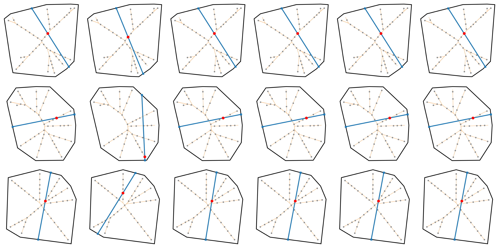
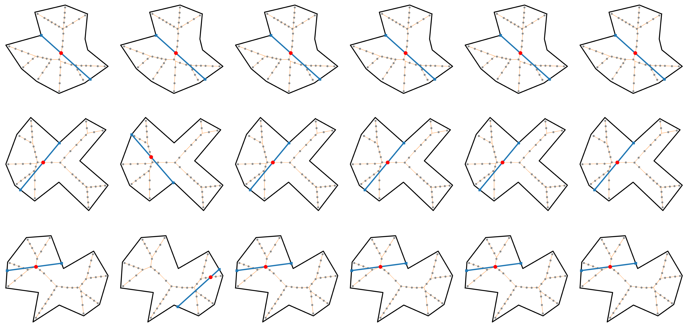
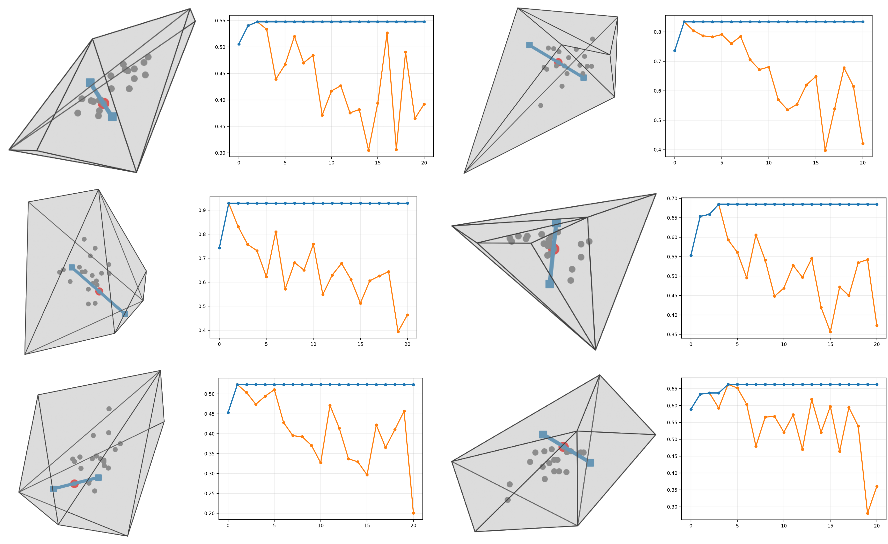

# Geometric Properties and Computation of the Width Function with Real-World Applications

**N.H. Hai**<sup>1,3</sup>, **L.A. Quan**<sup>2,3</sup>,
**T.V. Tien**<sup>2,3</sup>, **P.N.K. Cat**<sup>2,3</sup>,
**P.T. An**<sup>1,3,*</sup>

<sup>1</sup> Institute of Mathematical and Computational Sciences and Faculty of
Applied Science, Ho Chi Minh City University of Technology, 268 Ly Thuong Kiet,
Dien Hong Ward, Ho Chi Minh City, Vietnam<br>
<sup>2</sup> Faculty of Applied Science, Ho Chi Minh City University of Technology,
268 Ly Thuong Kiet, Dien Hong Ward, Ho Chi Minh City, Vietnam<br>
<sup>3</sup> Vietnam National University Ho Chi Minh City, Linh Xuan Ward,
Ho Chi Minh City, Vietnam<br>
<sup>*</sup> Corresponding author.

## Abstract

The width of a compact set $Q\subset\mathbb{R}^d$ at a point $p$ is the length
of the shortest segment through $p$ with endpoints on $\partial Q$, and
$W(Q;G):=\max_{p\in G}W(Q;p)$ for a finite $G\subset Q^\circ$. Unlike the
classical width of a convex body, it is defined on nonconvex sets. We establish
that $W(Q;\cdot)$ is a minimum of directional widths and, when $Q$ is convex,
is concave, hence locally Lipschitz with an interior maximizer. Above all, a
finite cover of $\partial Q$ by compact convex pieces reduces $W(Q;p)$ to a
minimum over pairs of pieces, making the problem finite without discretizing
$\partial Q$. This reduction is dimension independent, and yields an algorithm
returning $W(Q;G)$ exactly whenever its three geometric primitives are.
Numerical implementations of the exact algorithm in $\mathbb{R}^2$ and
$\mathbb{R}^3$, together with the planar adaptive $\varepsilon$-approximation,
compare accuracy and computation time on convex and nonconvex inputs. A
deep-learning pipeline is presented and applied to measuring concrete cracks
and Lugol-negative regions in cervical images.

## Definition and Properties

Let $Q\subset\mathbb{R}^d$ be compact and $p\in Q$. The width of $Q$ at $p$ is

$$
W(Q;p):=\inf_{\tau\in\mathcal S^{d-1}}W^\tau(p),
$$

where $W^\tau(p)$ is the length of the segment through $p$ in direction $\tau$
with endpoints on $\partial Q$. For a finite set
$G=\{q_1,\ldots,q_n\}\subset Q^\circ$,

$$
W(Q;G):=\max_{1\le k\le n}W(Q;q_k).
$$

If

$$
\partial Q=\bigcup_{i=1}^{N}E_i,
$$

where every $E_i$ is nonempty, compact, and convex, then

$$
W(Q;p)=\min_{(i,j)}\ell(E_i,E_j;p),
$$

where the minimum ranges over all pairs satisfying $1\le i<j\le N$ and
$p\in\mathrm{conv}(E_i\cup E_j)$.

Here

$$
\ell(E_i,E_j;p):=
\min\{\lVert x-y\rVert:x\in E_i,\ y\in E_j,\ p\in[x,y]\}.
$$

This finite-cover reduction is independent of the ambient dimension.

## Installation

Python 3.10 or newer is required.

```bash
git clone https://github.com/hoanghaihcmut/boundary-cover-width-algo.git
cd boundary-cover-width-algo
python -m venv .venv
source .venv/bin/activate
python -m pip install --upgrade pip
python -m pip install -e ".[dev,experiment]"
pytest -q
```

## Algorithm 1: Computing $W(Q;G)$ in $\mathbb{R}^d$

Input:

- a compact set $Q\subset\mathbb{R}^d$ with
  $\partial Q=\bigcup_{i=1}^{N}E_i$, where every $E_i$ is nonempty, compact,
  and convex;
- a finite set $G=\{q_1,\ldots,q_n\}\subset Q^\circ$.

Output: $W(Q;G)=\max_{1\le k\le n}W(Q;q_k)$.

For every $q_k$, define
$\delta_{k,i}:=\mathrm{dist}(q_k,E_i)$ and
$\delta_k:=\min_i\delta_{k,i}$. The query points are visited in nonincreasing
order of $\delta_k$. Candidate pairs $(i,j)$ are generated lazily in
nondecreasing order of $\delta_{k,i}+\delta_{k,j}$.

```text
reindex G so that delta_1 >= ... >= delta_n
omega_0 <- 2 delta_1

for k = 1, ..., n:
    mu <- +infinity
    for pairs (i, j), i < j, in nondecreasing order of delta_{k,i} + delta_{k,j}:
        if delta_{k,i} + delta_{k,j} >= mu:
            break
        if q_k not in conv(E_i union E_j):
            continue
        L <- ell(E_i, E_j; q_k)
        if L <= omega_{k-1}:
            mu <- 0
            break
        mu <- min(mu, L)
    omega_k <- max(omega_{k-1}, mu)

return omega_n
```

The algorithm returns $W(Q;G)$ exactly whenever the three geometric
primitives are evaluated exactly:

1. $\mathrm{dist}(q_k,E_i)$;
2. $q_k\in\mathrm{conv}(E_i\cup E_j)$;
3. $\ell(E_i,E_j;q_k)$.

The implementation is provided by
[`computing_width.py`](src/width_function/algorithms/computing_width.py). It
uses closed-form primitives for planar polygons and triangulated polyhedra and
a dimension-independent numerical implementation for general convex
polytopes.

## Algorithm 2: Adaptive $\varepsilon$-approximation of $W(Q;G)$

Input:

- a convex polygon $Q\subset\mathbb{R}^2$;
- a finite set $G=\{q_1,\ldots,q_n\}\subset Q^\circ$;
- $\varepsilon>0$.

Output: $\widehat W$ satisfying

$$
0\le\widehat W-W(Q;G)\le\varepsilon.
$$

Starting from $\theta_0$, define the nested direction sets

$$
F(j)=\{
(\cos(\theta_0+k\pi2^{1-j}),\sin(\theta_0+k\pi2^{1-j})):
k=0,\ldots,2^{j-1}-1
\}.
$$

For each $q_k$, let

$$
r_k:=\mathrm{dist}(q_k,\partial Q),\qquad
R_k:=\max\{\lVert v-q_k\rVert:v\text{ is a vertex of }Q\},
$$

and

$$
\Theta_k(j):=\frac{2\pi R_k^2}{r_k2^j}.
$$

At level $j_k$, the algorithm maintains

$$
\underline W_k:=\max\{2r_k,\overline W_k-\Theta_k(j_k)\}
\le W(Q;q_k)\le
\overline W_k:=\min_{\tau\in F(j_k)}W^\tau(q_k).
$$

It repeatedly refines a maximizer of $\overline W_k$ until
$\overline W-\underline W\le\varepsilon$, where
$\underline W:=\max_k\underline W_k$ and
$\overline W:=\max_k\overline W_k$.

```text
for k = 1, ..., n:
    r_k <- dist(q_k, boundary Q)
    R_k <- max { ||v - q_k|| : v is a vertex of Q }
    j_k <- 1
    upper_k <- min { W^tau(q_k) : tau in F(1) }
    lower_k <- max { 2 r_k, upper_k - Theta_k(1) }

lower <- max_k lower_k
upper <- max_k upper_k

while upper - lower > epsilon:
    choose k* in argmax_k upper_k
    j_{k*} <- j_{k*} + 1
    upper_{k*} <- min over the current value and the new directions
    lower_{k*} <- max { 2 r_{k*}, upper_{k*} - Theta_{k*}(j_{k*}) }
    lower <- max_k lower_k
    upper <- max_k upper_k

return upper
```

The implementation is provided by
[`adaptive_epsilon_approximation.py`](src/width_function/algorithms/adaptive_epsilon_approximation.py).

## Usage

```python
import numpy as np

from width_function.algorithms import algorithm_1, algorithm_2
from width_function.geometry import ConvexPolytope

polygon = np.array(
    [
        [-1.0, -1.0],
        [1.0, -1.0],
        [1.0, 1.0],
        [-1.0, 1.0],
    ]
)

boundary = [
    ConvexPolytope([start, end])
    for start, end in zip(polygon, np.roll(polygon, -1, axis=0), strict=True)
]
G = np.array([[0.0, 0.0], [0.2, 0.1]])

exact = algorithm_1(boundary, G)
approximation = algorithm_2(polygon, G, epsilon=1e-3, theta_0=0.25)

print(exact.width)
print(approximation.width)
```

## Numerical Experiments

### Random convex polygons

Three independently generated convex polygons are used. For each $Q_i$, 30
points are drawn uniformly from $[-1,1]^2$, the convex hull is formed, the
boundary is sampled at 64 equally spaced points per edge, and 50 points are
selected from the numerical medial skeleton to form $G_i$. Algorithm 1 is
compared with Algorithm 2 for
$\varepsilon\in\{10^{-1},10^{-2},10^{-3},10^{-4},10^{-5}\}$.

```bash
python experiments/random_convex_polygons.py \
  --n 30 --skeleton-points 50 --polygon-count 3 \
  --seed 20260820 --timing-repeats 3
```



Exact and adaptive maximizing chords for three random convex polygons. Rows:
$Q_1,Q_2,Q_3$. Columns: Algorithm 1, followed by the adaptive results for
$\varepsilon=10^{-1},10^{-2},10^{-3},10^{-4},10^{-5}$.

| Polygon | Maximizer | $W(Q_i;G_i)$ | Algorithm 1 time (s) |
| --- | ---: | ---: | ---: |
| $Q_1$ | $p_{19}$ | 1.8333863705 | 0.0312 |
| $Q_2$ | $p_{12}$ | 1.6215650941 | 0.0330 |
| $Q_3$ | $p_{31}$ | 1.7963512781 | 0.0356 |

For $\varepsilon\le10^{-2}$, the adaptive method identifies the exact
maximizing point. For $\varepsilon\le10^{-3}$, its observed error is below
$3.7\times10^{-8}$. Complete measurements are in
[`random_convex_polygons.csv`](results/random_convex_polygons/random_convex_polygons.csv)
and [`random_convex_polygons.json`](results/random_convex_polygons/random_convex_polygons.json).

### Random concave polygons

Three simple concave polygons with 12 vertices are generated from jittered
polar angles and random radii. Each $G_i$ contains 50 points selected from the
numerical medial skeleton. Algorithm 1 remains exact because the polygon edges
are compact convex pieces covering $\partial Q_i$. The adaptive refinement is
used only as an exploratory heuristic because its error bound requires
convexity.

```bash
python experiments/random_concave_polygons.py \
  --vertices 12 --skeleton-points 50 --polygon-count 3 \
  --seed 20260830 --timing-repeats 3
```



Exact and exploratory adaptive maximizing chords for three random concave
polygons. Rows: $Q_1,Q_2,Q_3$. Columns: Algorithm 1, followed by the heuristic
results for
$\varepsilon=10^{-1},10^{-2},10^{-3},10^{-4},10^{-5}$.

| Polygon | Maximizer | $W(Q_i;G_i)$ | Algorithm 1 time (s) |
| --- | ---: | ---: | ---: |
| $Q_1$ | $p_{35}$ | 1.1699821391 | 0.0322 |
| $Q_2$ | $p_{37}$ | 0.9403651923 | 0.0301 |
| $Q_3$ | $p_1$ | 0.9559819917 | 0.0292 |

Every observed error is below the requested tolerance. For
$\varepsilon\le10^{-2}$, the exact maximizing point is recovered in all twelve
runs and the largest error is $6.787\times10^{-6}$. Complete measurements are
in [`random_concave_polygons.csv`](results/random_concave_polygons/random_concave_polygons.csv)
and [`random_concave_polygons.json`](results/random_concave_polygons/random_concave_polygons.json).

### Random convex polyhedra in $\mathbb{R}^3$

Six random convex polyhedra are generated, each with six vertices, eight
triangular facets, and a set $G_i$ of 20 interior points. Algorithm 1 is run
once on $G_i$ and separately on each singleton $\{p_k\}$. The triangular
facets form the finite boundary cover.

```bash
python experiments/random_convex_polyhedra_3d.py \
  --vertices 6 --query-points 20 --polyhedron-count 6 \
  --seed 20260840 --timing-repeats 3
```



Algorithm 1 on six random convex polyhedra in $\mathbb{R}^3$, ordered row-wise
as $(Q_1,Q_2)$, $(Q_3,Q_4)$, and $(Q_5,Q_6)$. Each panel contains the
polyhedron and its sequence plot. The triangular boundary cover and $G_i$ are
gray, a maximizing point is red, and its shortest boundary chord is blue.
Orange is the exact singleton sequence $W(Q_i;p_k)$, while blue is the sequence
of incumbents $\omega_k$ from the full-$G_i$ run.

| Polyhedron | Maximizer | $\omega_0$ | $W(Q_i;G_i)$ | $t_G$ (s) | $t_{\{p_k\}}/t_G$ |
| --- | ---: | ---: | ---: | ---: | ---: |
| $Q_1$ | $p_8$ | 0.5057141959 | 0.5475405250 | 0.0170 | 1.33 |
| $Q_2$ | $p_{19}$ | 0.7361286464 | 0.8340694025 | 0.0254 | 2.03 |
| $Q_3$ | $p_8$ | 0.7432435110 | 0.9290164263 | 0.0228 | 1.46 |
| $Q_4$ | $p_{10}$ | 0.5530488920 | 0.6849535621 | 0.0329 | 1.49 |
| $Q_5$ | $p_{19}$ | 0.4529708664 | 0.5234453466 | 0.0200 | 1.46 |
| $Q_6$ | $p_2$ | 0.5893175477 | 0.6626558688 | 0.0188 | 1.34 |

The full-$G_i$ and singleton implementations return the same $W(Q_i;G_i)$ in
all six cases. Complete measurements are in
[`random_convex_polyhedra_3d.csv`](results/random_convex_polyhedra_3d/random_convex_polyhedra_3d.csv)
and [`random_convex_polyhedra_3d.json`](results/random_convex_polyhedra_3d/random_convex_polyhedra_3d.json).

## Real-World Applications

The repository includes executable implementations of the complete four-phase
workflow: Extraction and Polygonization, Selection of Set $G$, Width
Computation, and Calibration and Overlay.

- [`concrete_crack_self_healing.py`](applications/concrete_crack_self_healing.py)
  measures $W(Q_i;G_i)$ over registered concrete-crack observations while
  retaining the fixed initial skeleton set.
- [`lugol_negative_region_width.py`](applications/lugol_negative_region_width.py)
  segments the largest Lugol-negative region in a cervical image and reports
  $W_{\max}=W(Q;G)$ with its realizing segment.

Both YOLO checkpoints are included in [`models/`](models/). Installation,
commands, inputs, and outputs are documented in
[`applications/README.md`](applications/README.md).

## Repository Structure

```text
.
├── src/width_function/
│   ├── algorithms/
│   │   ├── computing_width.py
│   │   └── adaptive_epsilon_approximation.py
│   ├── applications/
│   │   └── segmented_regions.py
│   └── geometry/
│       ├── convex_polytope.py
│       ├── numerical_medial_skeleton.py
│       ├── planar_polygons.py
│       ├── stationarity_polynomial.py
│       └── triangulated_polyhedra.py
├── experiments/
│   ├── random_convex_polygons.py
│   ├── random_concave_polygons.py
│   └── random_convex_polyhedra_3d.py
├── applications/
│   ├── concrete_crack_self_healing.py
│   └── lugol_negative_region_width.py
├── models/
│   ├── concrete_crack_segmentation_yolov8n.pt
│   └── lugol_negative_region_segmentation_yolov8m.pt
├── results/
└── tests/
```
